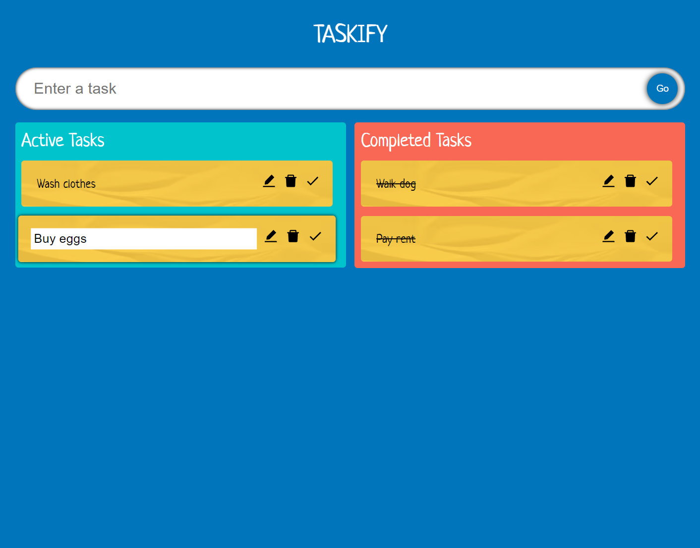

# Taskify

This project is a web-based "to do" website used to keep track of tasks that needed to be done or are completed. This was created using React Typescript.

Taskify is used to create tasks or "to do's" to be added to the list. Tasks can be edited, deleted, or crossed off. Tasks can also be dragged and dropped between the `Active Tasks` and `Completed Tasks` lists.

## Getting Started

To start the project on `localhost:3000`, run the following commands in the project directory:

### `npm start`

Runs the app in the development mode.\
Open [http://localhost:3000](http://localhost:3000) to view it in the browser.

Hot reload is active, so the page will reload if you make edits.\
You will also see any lint errors in the console.

### `npm test`

Launches the test runner in the interactive watch mode.\
See the section about [running tests](https://facebook.github.io/create-react-app/docs/running-tests) for more information.

### `npm run build`

Builds the app for production to the `build` folder.\
It correctly bundles React in production mode and optimizes the build for the best performance.

The build is minified and the filenames include the hashes.\
Your app is ready to be deployed!

## Screenshots

Below are screenshots of Taskify in action.

The standard Taskify screen with tasks in both lists. Tasks can be striked through by clicking on the checkmark button within each task.

\

Tasks can be moved from one list to the other by drag and dropping.

\

Tasks can be edited by clicking on the pencil button and writing the new name.
