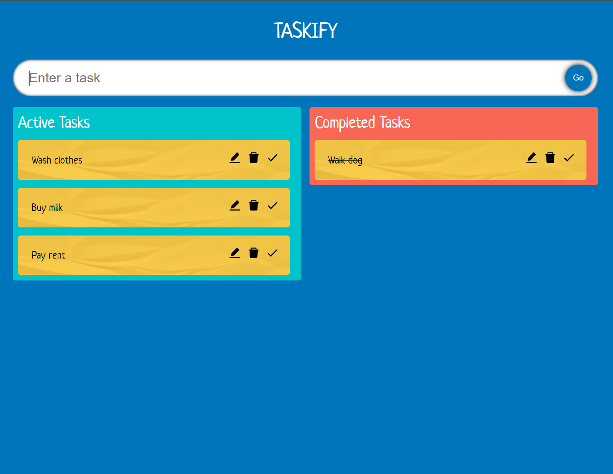
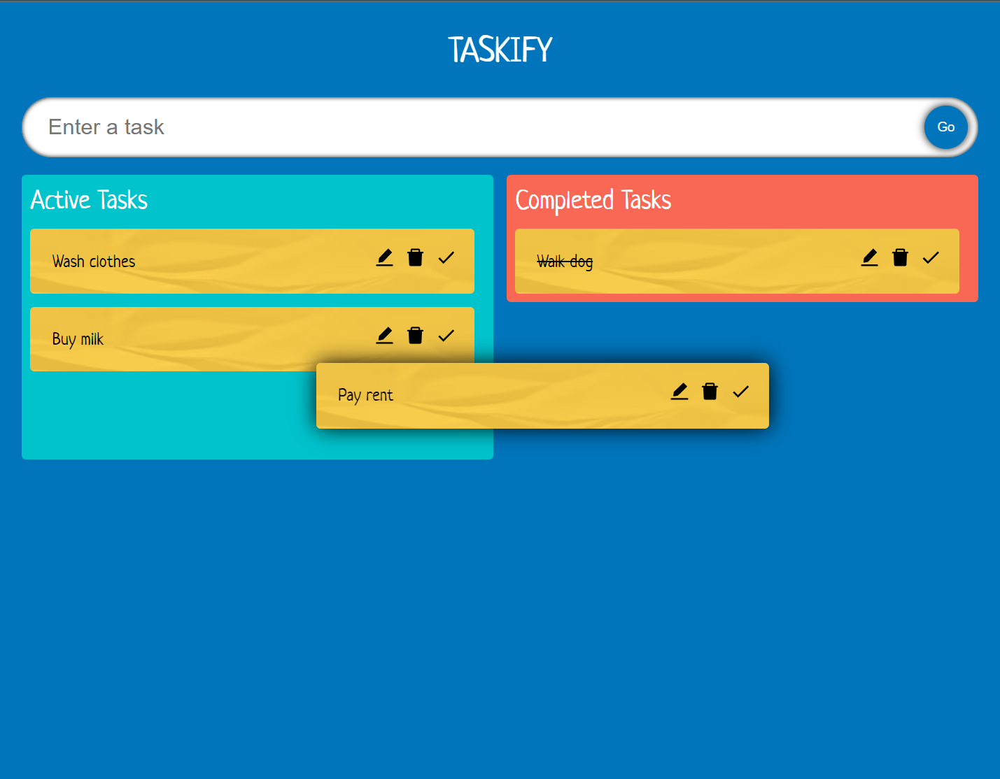
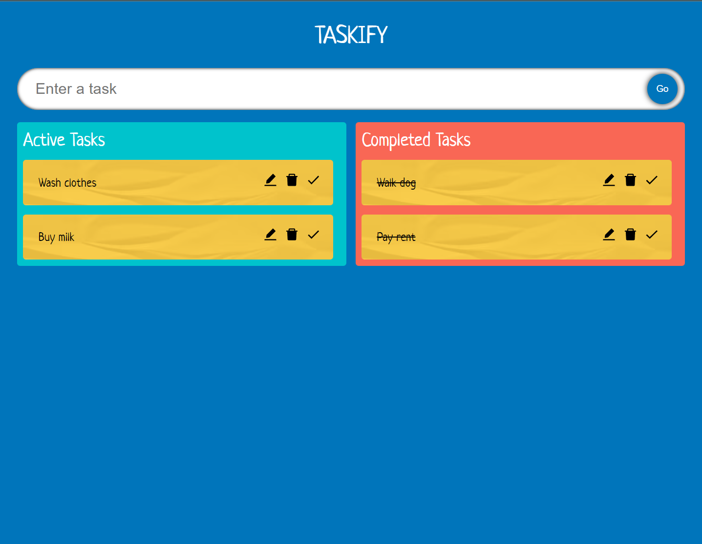

# Taskify

This project is a web-based "to do" website used to keep track of tasks that needed to be done or are completed. This was created using React Typescript.

## Getting Started

To start the project on `localhost:3000`, run the following commands in the project directory:

### `npm start`

Runs the app in the development mode.\
Open [http://localhost:3000](http://localhost:3000) to view it in the browser.

The page will reload if you make edits.\
You will also see any lint errors in the console.

### `npm test`

Launches the test runner in the interactive watch mode.\
See the section about [running tests](https://facebook.github.io/create-react-app/docs/running-tests) for more information.

### `npm run build`

Builds the app for production to the `build` folder.\
It correctly bundles React in production mode and optimizes the build for the best performance.

The build is minified and the filenames include the hashes.\
Your app is ready to be deployed!

See the section about [deployment](https://facebook.github.io/create-react-app/docs/deployment) for more information.

## Screenshots

Screenshots of the project in action.

The above is

The above image displays the dragging of a task in action.

